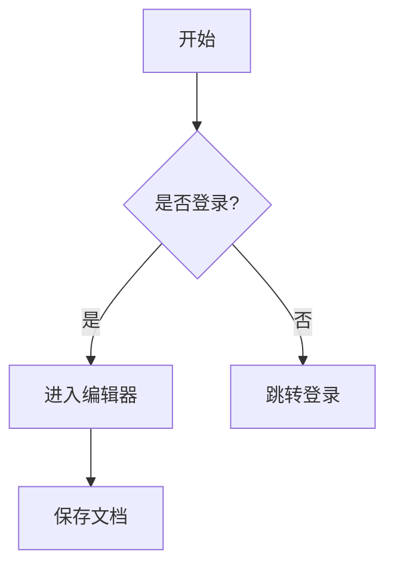
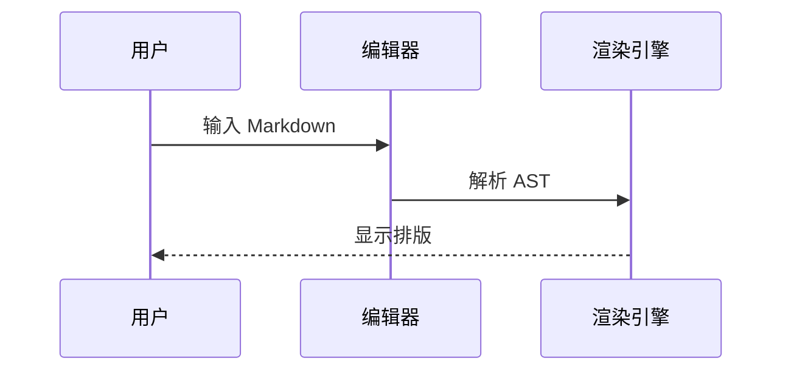
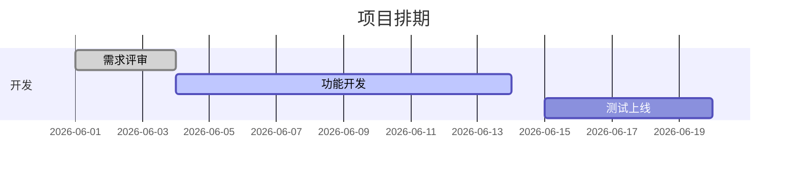

# Markdown 编辑器介绍与常用语法示例

> 本文档用于介绍 Markdown 编辑器的核心能力，并覆盖常用语法（以 **GFM / CommonMark** 为主，含常见扩展）。  
> 可作为产品说明、用户引导或编辑器渲染测试样张。

---

## 一、什么是 Markdown 编辑器？

Markdown 编辑器是一种**用轻量标记语法写文档、即时看到排版效果**的工具。相比 Word，它更适合：

- 技术文档、产品需求、开发笔记
- 周报日报、会议记录
- 知识库、个人/wiki 笔记
- 博客初稿、README、API 文档

典型能力包括：

| 能力       | 说明                           |
| -------- | ---------------------------- |
| **即时渲染** | 边写边看标题、列表、表格等排版效果（类似 Typora） |
| **源码模式** | 直接编辑 `#`、`**` 等原始符号（适合精确控制）  |
| **主题切换** | 深色/浅色、自定义字体与配色               |
| **导出分享** | 复制为富文本/HTML/Markdown，或导出 PDF |
| **扩展语法** | 任务列表、表格、代码高亮、公式、图表等          |

---

## 二、基础排版

### 2.1 标题（Heading）

Markdown 支持 1～6 级标题，用行首 `#` 数量表示层级。

```markdown
# 一级标题
## 二级标题
### 三级标题
#### 四级标题
##### 五级标题
###### 六级标题
```

渲染效果：

# 一级标题

## 二级标题

### 三级标题

#### 四级标题

##### 五级标题

###### 六级标题

---

### 2.2 强调（粗体 / 斜体 / 删除线 / 高亮）

| 样式   | 语法                  | 示例            |
| ---- | ------------------- | ------------- |
| 粗体   | `**文字**` 或 `__文字__` | **这是粗体**      |
| 斜体   | `*文字*` 或 `_文字_`     | *这是斜体*        |
| 粗斜体  | `***文字***`          | ***粗斜体***     |
| 删除线  | `~~文字~~`            | ~~已删除~~       |
| 高亮   | `==文字==`（扩展）        | ==高亮文字==      |
| 行内代码 | `` `code` ``        | `const x = 1` |

---

## 三、链接与图片

### 3.1 行内链接

```markdown
[金山文档](https://www.kdocs.cn)
[带标题的链接](https://www.kdocs.cn "鼠标悬停提示")
```

[金山文档](https://www.kdocs.cn)

### 3.2 自动链接

```markdown
<https://www.kdocs.cn>
```

<https://www.kdocs.cn>

### 3.4 图片

```markdown

```


```

```


---

## 四、列表

### 4.1 无序列表

```markdown
- 项目 A
- 项目 B
  - 子项目 B1
  - 子项目 B2
- 项目 C

* 也可用星号
+ 或加号
```

- 项目 A
- 项目 B
  - 子项目 B1
  - 子项目 B2
- 项目 C

### 4.2 有序列表

```markdown
1. 第一步
2. 第二步
3. 第三步
   1. 子步骤 3.1
   2. 子步骤 3.2
```

1. 第一步
2. 第二步
3. 第三步

### 4.3 任务列表（GFM）

```markdown
- [x] 已完成的任务
- [ ] 未完成的任务
- [ ] 另一项待办
```

- [x] 已完成的任务
- [ ] 未完成的任务
- [ ] 另一项待办

---

## 五、引用块

### 5.1 单层引用

```markdown
> 这是一段引用文字。
> 可以写多行。
```

> 这是一段引用文字。  
> 可以写多行。

### 5.2 嵌套引用

```markdown
> 外层引用
>> 内层引用
>>> 更深层
```

> 外层引用
>
> > 内层引用

---

## 六、代码

### 6.1 行内代码

```markdown
使用 `npm install` 安装依赖，变量名如 `userName`。
```

### 6.2 围栏代码块（Fenced Code Block）

在首尾各写三个反引号或波浪号，并可指定语言以启用高亮：

```clike
function greet(name) {
  return `Hello, ${name}!`;
}
console.log(greet('WPS-MD'));
```

## 七、表格（GFM）

### 7.1 基础表格

```markdown
| 列1 | 列2 | 列3 |
| --- | --- | --- |
| A1  | B1  | C1  |
| A2  | B2  | C2  |
```

| 列1  | 列2  | 列3  |
| --- | --- | --- |
| A1  | B1  | C1  |
| A2  | B2  | C2  |

### 7.2 对齐方式

```markdown
| 左对齐 | 居中 | 右对齐 |
| :----- | :--: | -----: |
| left   | mid  | right  |
```

| 左对齐  | 居中  | 右对齐   |
|:---- |:---:| -----:|
| left | mid | right |

### 7.3 表格内格式

| 功能                         | 状态  | 说明       |
| -------------------------- | --- | -------- |
| **加粗**                     | ✅   | `Ctrl+B` |
| *斜体*                       | ✅   | `Ctrl+I` |
| [链接](https://www.kdocs.cn) | ✅   | 可点击      |

---

## 八、分割线

```markdown
---
***
___
- - -
```

以上均可渲染为水平分割线：

---

## 九、数学公式（扩展）

行内公式：`$E = mc^2$`

块级公式：

$$
\int_{a}^{b} f(x)\,dx = F(b) - F(a)
$$

## 十、图表（Mermaid 等扩展）

### 10.1 流程图



### 10.2 时序图



### 10.3 甘特图



---

## 十一、元数据（Front Matter）

文档顶部 YAML 元信息（静态站点、部分笔记软件）：

```yaml
---
title: Markdown 编辑器介绍
author: 产品团队
date: 2026-06-29
tags: [markdown, editor, gfm]
---
```

---

## 十二、常用语法汇总

| 类别   | 语法                  | 渲染     |
| ---- | ------------------- | ------ |
| H1   | `# 标题`              | 一级标题   |
| 粗体   | `**x**`             | **x**  |
| 斜体   | `*x*`               | *x*    |
| 删除线  | `~~x~~`             | ~~x~~  |
| 链接   | `[t](url)`          | 超链接    |
| 图片   | ``       | 图片     |
| 无序列表 | `- item`            | • 列表   |
| 有序列表 | `1. item`           | 1. 列表  |
| 任务   | `- [ ] todo`        | ☐ 待办   |
| 引用   | `> quote`           | 引用块    |
| 行内代码 | `` `code` ``        | `code` |
| 代码块  | ` ```lang `         | 高亮块    |
| 表格   | `\| a \| b \|`      | 表格     |
| 分割线  | `---`               | 横线     |
| 公式   | `$...$` / `$$...$$` | 数学     |
| 图表   | ` ```mermaid `      | 流程图等   |

---

## 十三、结语

Markdown 的核心价值是：**结构清晰、纯文本可版本管理、写作不被排版打断**。  
一份好的 MD 编辑器，应在「写得爽」（即时渲染、快捷键、主题）和「用得广」（复制、导出、标准兼容）之间取得平衡。

---

*文档版本：v1.0 | 用途：产品介绍 + 全语法测试样张*
